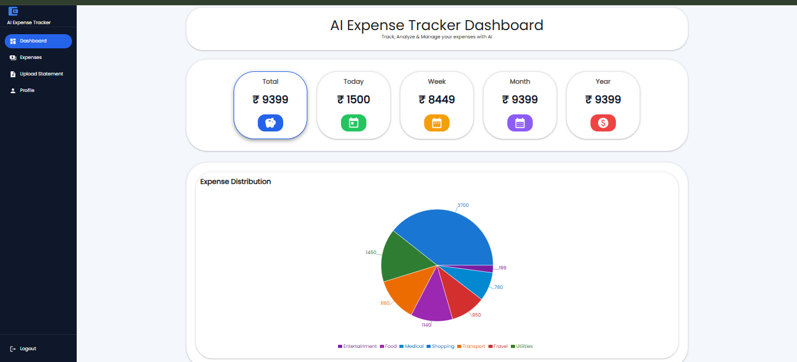

# 💰 AI Expense Tracker

An AI-powered Personal Finance Management System built using **FastAPI**, **React**, **MySQL**, **Docker**, and **Google Gemini AI**. The application helps users manage expenses, upload bank statements, visualize spending patterns, and gain AI-powered financial insights.

---

## 🚀 Features

- 🔐 JWT Authentication
- 💳 Expense Management (CRUD)
- 📂 CSV Statement Upload
- 📊 Interactive Dashboard
- 📈 Expense Analytics
- 🤖 AI Expense Categorization
- 👤 User Profile
- 🐳 Dockerized Frontend & Backend
- ☁️ AWS Deployment Ready

---

## 📊 Dashboard

The dashboard provides a complete overview of your financial activities, including total expenses, category-wise spending, recent transactions, and interactive charts.

<p align="center">
  
</p>

---

## 🛠️ Tech Stack

### Frontend
- React
- Vite
- Material UI (MUI)
- Axios
- React Router
- Recharts

### Backend
- FastAPI
- SQLAlchemy
- JWT Authentication
- Google Gemini AI
- Pandas
- Uvicorn

### Database
- MySQL

### DevOps
- Docker
- Docker Compose
- Nginx

---

## 📁 Project Structure

```text
ExpenseTracker/
│
├── docker-compose.yml
│
├── expense-tracker-ai/
│   ├── app/
│   ├── Dockerfile
│   ├── requirements.txt
│   └── .env
│
└── expense-tracker-frontend/
    ├── src/
    ├── Dockerfile
    ├── nginx.conf
    ├── package.json
    └── screenshots/
        └── dashboard.png
```

---

## ⚙️ Local Setup

### Backend

```bash
cd expense-tracker-ai

python -m venv venv

venv\Scripts\activate

pip install -r requirements.txt

uvicorn app.main:app --reload
```

Backend:

```
http://127.0.0.1:8000
```

Swagger:

```
http://127.0.0.1:8000/docs
```

---

### Frontend

```bash
cd expense-tracker-frontend

npm install

npm run dev
```

Frontend:

```
http://localhost:5173
```

---

## 🐳 Docker Deployment

```bash
docker compose up -d --build
```

Frontend:

```
http://localhost:3000
```

Backend:

```
http://localhost:8000
```

Swagger:

```
http://localhost:8000/docs
```

---

## 🔑 Environment Variables

Create a `.env` file inside `expense-tracker-ai`.

```env
DB_HOST=localhost
DB_PORT=3306
DB_NAME=expense_tracker
DB_USER=root
DB_PASSWORD=your_password

SECRET_KEY=your_secret_key
ALGORITHM=HS256
ACCESS_TOKEN_EXPIRE_MINUTES=30

GEMINI_API_KEY=your_gemini_api_key
```

For Docker with MySQL running on the host:

```env
DB_HOST=host.docker.internal
```

---

## 📌 Future Enhancements

- Budget Planning
- AI Spending Recommendations
- OCR Receipt Scanner
- Email Notifications
- AWS RDS Integration
- CI/CD with GitHub Actions
- Kubernetes Deployment

---

## 👨‍💻 Author

**Praveen Kumar**

- GitHub: https://github.com/praveenku99887
- LinkedIn: https://linkedin.com/in/praveenku99887
---

## ⭐ Support

If you like this project, please give it a ⭐ on GitHub.
